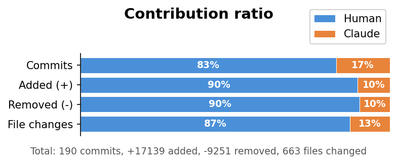

 Create a command line interface with minimal setup.

[](https://pypi.org/project/clima/)
[]()
[]() 

# Command line interface (Cli) with a schema (Ma) - Clima

## Installation

```
pip install clima
```

Requires Python 3.9.2+.

## Quick example

```python
from clima import Schema

class S(Schema):
    place = 'Finland'

@S.cli
class Cli:
    def say_hi(self):
        print(f'Hi from {S.place}')
```

```
$ cli.py say_hi
Hi from Finland
$ cli.py say_hi --place 'Sweden'
Hi from Sweden
```


## Thorough example

```python
from clima import Schema

class C(Schema):
    name: str = None  # (Required) Your first name
    surname: str = 'Ma'  # Surname
    age: int = '132'  # Age is just a number

@C.cli
class Something:
    """Python docstrings are parsed to use for the help printout on the command line.
    This would show as the main help, while the class method docstrings show as subcommand helps.
    """

    def print_name(self):
        """
        This command prints name.
        Required parameters are defined by using 'None' as the default value in the configuration class i.e. C(Schema).
        """
        print(f'{C.name} {C.surname}')

    def print_age(self):
        """
        This here, prints my age.
        The parameter name is not required here, as it is not used within this subcommand.
        """
        print(C.age)

# Example printouts

# $ python main.py
# Usage:       main.py
#              main.py print-age
#              main.py print-name
# Description: Python docstrings are parsed to use for the help printout on the command line.
# This would show as the main help, while the class method docstrings show as subcommand helps.

# $ python main.py print-name -h
# Usage:       main.py print-name [ARGS]
#
# Description: This command prints name.
# Required parameters are defined by using 'None' as the default value in the configuration class i.e. C(Schema).
#
# Args:
#     --name (str): (Required) Your first name (Default is None)
#     --surname (str): Surname (Default is 'Ma')
#     --age (int): Age is just a number (Default is '132')

# $ python main.py print-name --name YoYo
# YoYo Ma

# $ python main.py print-age
# 132
```
## Why Clima?

Clima eliminates CLI boilerplate: just define a `Schema` dataclass and a `Cli` class. Opinionated for convenience; Unlike click, typer, or argparse, clima gives you a built-in config cascade (CLI args → env vars → `.env` file → config file → defaults) with zero extra code. 

## Features

Schema fields double as CLI flags, environment variables, and config file keys automatically while providing help printout, default values and type casting.

- **Config cascade** :: CLI args → env vars → `.env` file → config file → defaults, resolved automatically
- **Type casting** :: Schema field annotations are used to cast string CLI/env values to the right type
- **Help from field comments** :: Docstrings on Schema fields act as `--help` output
- **IDE completions** :: `C.name` is typed as `str` — completions and type checking work natively
- **`--verbose` / `--quiet` logging** :: Add `verbose: bool` or `quiet: bool` to Schema and get preconfigured logging
- **Undefined param warnings** :: Unknown `--flags` on the command line produce a clear warning
- **`version` subcommand** :: `myscript version` prints the package version automatically
- **Config file support** :: Declare defaults in an INI-style `.conf` file keyed to your package name
- **`.env` file and env var support** :: Schema fields are also read from environment variables and `.env` files
- **Optional gpg secrets** :: Decrypt secrets via `pass` / gnupg if installed
- **Optional shortened tracebacks** :: Truncate python tracebacks into an opinionated format

## Legacy API

Older code uses `from clima import c` and the `@c` decorator. This still works:

```python
from clima import c, Schema

class S(Schema):
    place = 'Finland'

@c
class Cli:
    def say_hi(self):
        print(f'Hi from {c.place}')
```

The `@S.cli` form is preferred because `S.place` gives IDE completions with correct types.

## Documentation

Full documentation at [python-clima.readthedocs.io](https://python-clima.readthedocs.io/).

See and run the `examples/` directory for more usage patterns.

## AI Disclaimer

This work started in 2019 as my hobby project and continues as so. Claude was used to bridge gaps I had planned, but had not had the time to address.

Before merging to main and uploading to pypi the code is hand-vetted to find all code assistance related issues.


